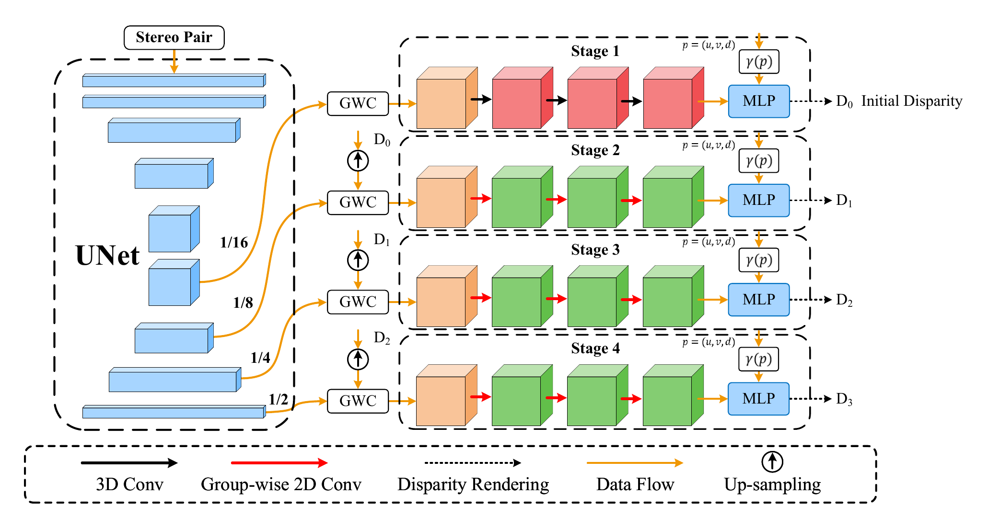
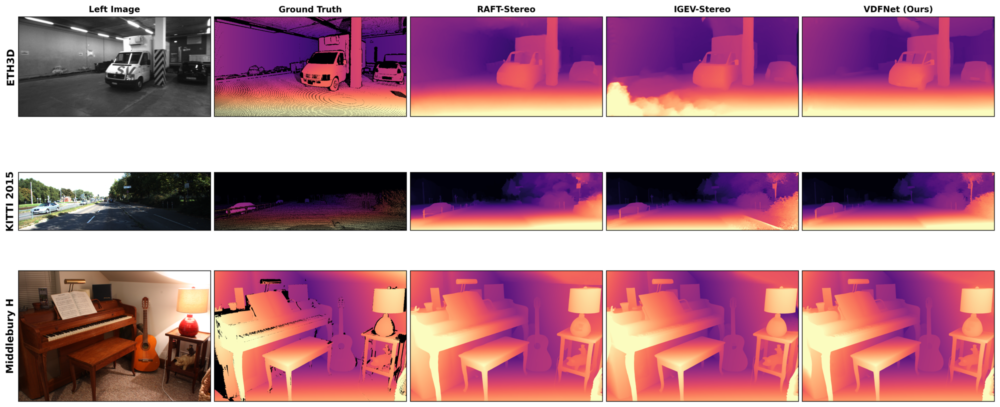
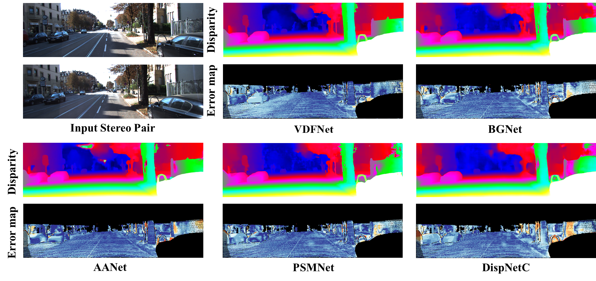

<div align="center">

# VDFNet: A NeRF-Inspired Volume Density Field Rendering Paradigm for Stereo Matching

**A NeRF-inspired, plug-and-play replacement for soft-argmin that improves cross-domain generalization at zero parameter cost.**




</div>

---

**VDFNet** reinterprets the disparity estimation stage as **volumetric density field rendering**. Instead of soft-argmin regression, it models the disparity distribution as a 1D density field along the disparity axis and renders disparity via NeRF-style alpha compositing — a physically interpretable, multi-modal estimator. The `disparityrender` operator is a **drop-in replacement for the soft-argmin head**, validated on four independent backbones (IGEV, GwcNet, PSMNet, AANet): it keeps in-domain accuracy comparable while significantly improving **zero-shot cross-domain generalization**.

> 📄 Paper: *VDFNet: A NeRF-Inspired Volume Density Field Rendering Paradigm for Stereo Matching* — under review, IEEE TNNLS.
> Pretrained weights + one-command scripts reproduce the paper's Table I & II directly.

> [!IMPORTANT]
> This repository provides the evaluation code and pretrained weights for reviewer reproduction.
> **The complete codebase will be open-sourced upon acceptance.**

## Contents

- [Reproducing the paper results](#reproducing-the-paper-results)
- [Installation](#installation)
- [Datasets](#datasets)
- [Pretrained models](#pretrained-models)
- [Evaluation](#evaluation)
- [Results](#results)
- [Citation](#citation) · [License](#license)

---

## Reproducing the paper results

From a fresh clone to the numbers reported in the paper in five steps.

1. **Set up the environment** — follow [Installation](#installation).
2. **Get the data** — [SceneFlow](#datasets) for in-domain; ETH3D / KITTI 2015 / Middlebury H for zero-shot. Run `bash scripts/setup_eval_data.sh` to download ETH3D + Middlebury automatically.
3. **Get the checkpoints** — download the three IGEV checkpoints from [Pretrained models](#pretrained-models).
4. **Reproduce Table I** (in-domain ablation):

```bash
cd igev_baseline
SCENEFLOW_DIR=/path/to/SceneFlow python reproduce_table1.py \
    --softargmin /path/to/vdfnet_igev_softargmin_sceneflow.pth \
    --render     /path/to/vdfnet_igev_render_sceneflow.pth \
    --render_temp /path/to/vdfnet_igev_render_temp_sceneflow.pth
```

5. **Reproduce Table II** (zero-shot cross-domain, IGEV rows):

```bash
cd igev_baseline
python reproduce_table2.py \
    --softargmin /path/to/vdfnet_igev_softargmin_sceneflow.pth \
    --render     /path/to/vdfnet_igev_render_sceneflow.pth \
    --datasets eth3d kitti middlebury_H
```

Both scripts print measured vs. paper values side by side.

### Expected results

**Table I — SceneFlow test set (in-domain):**

| Disparity head | Checkpoint | EPE | 1-ER% | 3-ER% |
|----------------|-----------|-----|-------|-------|
| soft-argmin (baseline) | `..._softargmin_...` | 0.4813 | 5.29 | 2.50 |
| +disparityrender | `..._render_...` | 0.4790 | 5.38 | 2.51 |
| +density_temperature (flagship) | `..._render_temp_...` | **0.4686** | **5.24** | **2.45** |

**Table II — zero-shot cross-domain (SceneFlow-trained, no fine-tuning):**

| Disparity head | ETH3D EPE | KITTI D1-all | Middlebury H EPE |
|----------------|-----------|--------------|------------------|
| soft-argmin (baseline) | 0.322 | 6.67% | 0.848 |
| +disparityrender | **0.279** | **5.96%** | **0.885** |

> `disparityrender` is comparable in-domain but significantly improves zero-shot cross-domain generalization across four architecturally distinct backbones.

---

## Installation

### Verified environment

Ubuntu 22.04, NVIDIA RTX 5090 ×2 (sm_120), CUDA 12.8, Python 3.10, PyTorch 2.11+cu128. Older GPUs (Turing/Ampere/Ada) work with matching CUDA and PyTorch versions.

### Steps

```bash
# 1. Create environment
conda create -y -n vdfnet python=3.10 && conda activate vdfnet

# 2. PyTorch (match your CUDA/GPU arch)
pip install torch torchvision --index-url https://download.pytorch.org/whl/cu128
# Older GPUs: see https://pytorch.org for the matching index-url

# 3. Other dependencies
pip install -r requirements.txt

# 4. Configure paths and verify
cp env.sh.example env.sh   # edit VDFNET_DATA, VDFNET_EVAL_DATA, VDFNET_CKPT
source env.sh && bash check_env.sh
```

---

## Datasets

### SceneFlow (Table I)

Download [FlyingThings3D, Monkaa, Driving](https://lmb.informatik.uni-freiburg.de/resources/datasets/SceneFlowDatasets.en.html) and organize as:

```
SceneFlow/
├── FlyingThings3D/{frames_finalpass,disparity}/
├── Monkaa/{frames_finalpass,disparity}/
└── Driving/{frames_finalpass,disparity}/
```

### Zero-shot evaluation sets (Table II)

```bash
EVAL_ROOT=/data bash scripts/setup_eval_data.sh   # downloads ETH3D + Middlebury
```

Expected layout:

```
/data/
├── ETH3D/two_view_training/<scene>/{im0.png,im1.png}
│        two_view_training_gt/<scene>/disp0GT.pfm
├── Middlebury/trainingH/<scene>/{im0.png,im1.png,disp0GT.pfm}
└── KITTI/KITTI_2015/training/{image_2,image_3,disp_occ_0}/*_10.png
```

**KITTI** requires a free registered login at [cvlibs.net](https://www.cvlibs.net/datasets/kitti/). Symlink your data into `/data` if it lives elsewhere.

---

## Pretrained models

Download from the [GitHub Releases](https://github.com/vdfnet-anon/vdfnet/releases) page and place under `./checkpoints`.

| Disparity head | File | EPE | MD5 |
|----------------|------|-----|-----|
| soft-argmin (baseline) | `vdfnet_igev_softargmin_sceneflow.pth` | 0.4813 | `e2b9e4d4f7de26318fd9872d44e305a3` |
| +disparityrender | `vdfnet_igev_render_sceneflow.pth` | 0.4790 | `3c3bbea407798d75a13da84edd43ac84` |
| +density_temperature (flagship) | `vdfnet_igev_render_temp_sceneflow.pth` | **0.4686** | `10df737182e4de84bbbfd410d898a9e1` |

**Loading note:** checkpoints are saved with a `module.` prefix (DDP training). Strip it if loading outside DataParallel:

```python
ck = torch.load(path, map_location='cpu')
sd = {k.replace('module.', '', 1): v for k, v in ck.items()}
model.load_state_dict(sd)
```

---

## Evaluation

```bash
cd igev_baseline

# SceneFlow test set (EPE / 1-ER / 3-ER):
SCENEFLOW_DIR=/path/to/SceneFlow python evaluate_stereo.py \
    --restore_ckpt /path/to/vdfnet_igev_render_temp_sceneflow.pth --dataset sceneflow

# Zero-shot cross-domain:
python evaluate_stereo.py \
    --restore_ckpt /path/to/vdfnet_igev_render_sceneflow.pth --dataset eth3d
python evaluate_stereo.py \
    --restore_ckpt /path/to/vdfnet_igev_render_sceneflow.pth --dataset kitti
python evaluate_stereo.py \
    --restore_ckpt /path/to/vdfnet_igev_render_sceneflow.pth --dataset middlebury_H
```

> The baseline checkpoint loads into `igev_stereo_original`; the render variants load into `igev_stereo`. The reproduction scripts select the correct class automatically.

---

## Results

### Zero-shot cross-domain generalization

All models trained on SceneFlow only, evaluated without any fine-tuning. VDFNet (`disparityrender`) produces sharper boundaries and fewer large errors than RAFT-Stereo and IGEV-Stereo (soft-argmin) across ETH3D, KITTI 2015, and Middlebury H.



### KITTI 2015 benchmark (fine-tuned)



---

## Citation

```bibtex
@article{vdfnet,
  title   = {VDFNet: A NeRF-Inspired Volume Density Field Rendering Paradigm for Stereo Matching},
  author  = {VDFNet Authors},
  journal = {IEEE Transactions on Neural Networks and Learning Systems},
  note    = {Under review},
  year    = {2026}
}
```

---

## License

Released under the [MIT License](LICENSE).
